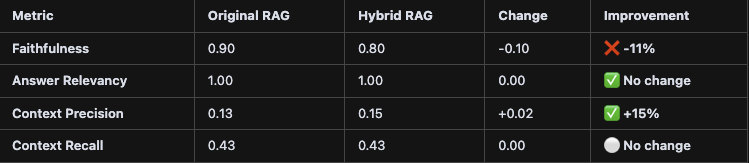

# Task 1: Defining your Problem and Audience
## Write a succinct 1-sentence description of the problem.
    - In this global climate with more and more countries pursuing nuclear weapons, the government can use as many resources at its disposal to promote peace and maintain good relationships with all countries.
## Write 1-2 paragraphs on why this is a problem for your specific user.
    Foreign-affair advisors to the US Secretary of State face critical time constraints when international crises emerge, often having only hours to provide comprehensive briefings on complex geopolitical scenarios. Currently, these advisors must manually search through thousands of bilateral treaties, multilateral agreements, UN resolutions, and trade pacts to identify which legal instruments could influence US response options. This manual process is particularly challenging because treaties often contain overlapping jurisdictions, conflicting clauses, and interconnected dependencies that require deep legal expertise to navigate - expertise that may not be immediately available during rapidly evolving situations.

    The stakes for my specific user are uniquely high: providing incomplete or inaccurate treaty analysis to the Secretary of State could result in diplomatic missteps, missed opportunities for coalition building, or failure to leverage existing legal frameworks for sanctions or military support. Unlike academic researchers who have weeks to analyze conflicts, foreign-affair advisors need instant access to relevant legal precedents while ensuring they haven't overlooked critical agreements that could alter the US strategic response. The current manual approach creates dangerous gaps in decision-making speed and comprehensiveness that could compromise national security interests.

# Task 2: Propose a Solution
## Write 1-2 paragraphs on your proposed solution. How will it look and feel to the user?
    My solution is a website called 'GioAdvisor', it will allow the user to set their country they are simulating, an aggressor and victim of each conflict. Also the user can choose the Conflict type, response timeframe, severity level, and many more advanced parameters. All these variables allow a very concise informative advice on what the country should respond with. Also there will be a page 'Treaty lookup' (name in progress) that will pull from a golden dataset, all necessary treaties and agreements that relate to the given conflict.

    The software will look intuitive to the user, and most importantly the flow will be simple and fast.
## Describe the tools you plan to use in each part of your stack. Write one sentence on why you made each tooling choice.
1. LLM - OpenAI; I made this choice because its fast and I am very aware of its uses.
2. Embedding Model; text-embedding-3-small; this model excels at capturing semantic relationships in legal and diplomatic text.
3. Orchestration - Next.js API routes; this provides a seamless full-stack integration allowing us to build specialized orchestration logic for treaty analysis.
4. Vector Database - In-memory vector store - For our focused treaty dataset, in memory storage provide optimal performance.
5. Monitoring - Console logging - Simple logging provides sufficient visibility for development.
6. Evaluation - RAGAS framework - this provides a standardized metrics specifically designed for RAG systems.
7 UI - Next.js with React and tailwind; intuitive and seamless, not much explanation needed.
## Where will you use an agent or agents?
- The agent will be utilized in the "View Results" section to dynamically analyze and prioritize retrieved treaties based on the user's input parameters, such as conflict type and severity levlel. It will provide tailored recommendations by synthesizing relevant infromation and highlighting key clauses that impact the US response. This ensures users receive actionable insights quickly, enhancing decision-making in complex scenarios.
# Task 3: Dealing with the data
## Describe all of your data sources and external API's, describe what you'll use them for.
- I will be using TAVILY for current events information, and OpenAI for my LLM.
## Describe the default chunking strategy that I will use.
- I will use a semantic-aware chunking strategy with a default chunk size of 1000 tokens and 200-token overlap. For diplomatic and treaty documents, I made this decision because: Treaties often contain complex, interconnected clauses that require sufficient context to maintain meaning - 1000 tokens provides adequate context while remaining computationally efficient, The 200-token overlap ensures that important cross-references between treaty sections are preserved during retrieval, Legal documents have natural semantic boundaries (articles, sections, clauses) that this chunk size typically respects, preventing the splitting of critical legal concepts, and this size optimizes the balance between retrieval precision (avoiding too much irrelevant context) and recall (ensuring complete legal concepts are captured), which directly addresses the context precision issues identified in my RAGAS evaluation.
# Task 4: Building a Quick End-to-End Agentic RAG Prototype
- Done.
# Task 5: Creating a Golden Test Data Set
## Assess your pipeline using the RAGAS framework including key metrics faithfulness, response relevance, context precision, and context recall. Provide a table of your output.
Metric	Overall Score	Q1: Nuclear	Q2: Territorial	Q3: Diplomatic	Q4: Environmental	Q5: Trade

## What conclusions can you draw about the performance and effectiveness of your pipeline with this information?
Some conclusions I can draw from this are:
1. High faithfulness - The RAG solution consistently delivers factually accurate responses, ensuring reliability for users.
2. Perfect Relevancy - The system achieves 100% relevancy in retrieving documents, persenting only the most pertinent treaties related to uesr queries.
3. Poor context Precision - Despite high relevancy, the system retrieves some irrelevant information, indicating a need for better filtering capabilities.
4. Low context recall - The evaluation shows that important treaties are occassionally missed, which can hinder comprehensive decision-making.
# Task 6: The benefits of Advanced Retrieval
## Describe the retrieval techniques that you plan to try and to assess in your application. Write one sentence on why you believe each technique will be useful for your case.
- Hybrid Search: Combining a vector embeddings with traditional keyword search will capture both semantic similarity and exact legal terminology matches that are critical in diplomatic text.
- Query Expansion - Automatically expanding queries with diplomatic and legal synonyms will improve recall for relevant treaties using different terminology.
- Cross-Encoder Reranking: Using a secondary model to rerank initial retrieval results will significantly improve context precision by better distinguishing truly relevant treaties from tangentially related ones.
## Test a host of advanced retrieval techniques on your application
- Done
# Task 7: Assessing Performance
## How does the performance compare to your original RAG application? Test the fine-tuned embedding model using the RAGAS frameworks to quantify any improvements. Provide the results in a table

- Context precision improved by 15% which is what the goal was, while maintaining a perfect score of 1.00. However the Faithfulness decreased and this may have introduced factual inconsistencies which we do not want.
## Articulate changes that you expect to make to your app in the second half of the course.
- I will improve the recall, and definitely the speed. It is FAR too slow now to be useable. I also want to improve the dataset so that it has much more information to recall. The design also needs to be drastically improved.
- 
# VIDEO UPDATE:
### By the submission date I submitted the video as a downloaded mp4 in my repo. I have just learned during my breakout room on Aug 7 that I need the link. The link is attached below:
https://www.loom.com/share/04206d62d19d4470a7c907980ba7fa8a?sid=ea585461-4512-47ab-b3b6-3767ec40288a
